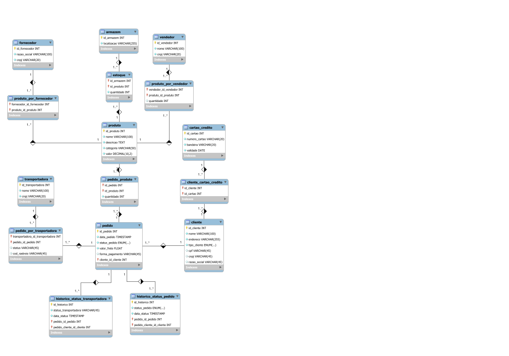

# Modelo de Banco de Dados para E-commerce

## Visão Geral

Este documento descreve o modelo de dados para um sistema de e-commerce. O banco de dados é projetado para suportar as funcionalidades principais de uma plataforma de e-commerce, incluindo gerenciamento de clientes, catálogo de produtos, processamento de pedidos e gerenciamento de estoque.

## Esquema: `mydb`

### Tabelas

#### `cliente`

Armazena informações dos clientes, incluindo detalhes pessoais e comerciais.

- **Colunas**:
  - `id_cliente` (INT, Chave Primária, Auto Incremento): Identificador único do cliente.
  - `nome` (VARCHAR 100): Nome do cliente.
  - `endereco` (VARCHAR 255): Endereço do cliente.
  - `tipo_cliente` (ENUM): Tipo de cliente ('Pessoa Física' ou 'Pessoa Jurídica').
  - `cpf` (VARCHAR 45): Número do CPF (para 'Pessoa Física').
  - `cnpj` (VARCHAR 45): Número do CNPJ (para 'Pessoa Jurídica').
  - `razao_social` (VARCHAR 45): Razão social (para 'Pessoa Jurídica').

- **Restrições**:
  - `chk_cliente_tipo`: Garante a consistência dos dados com base no tipo de cliente.

#### `cartao_credito`

Armazena informações sobre cartões de crédito.

- **Colunas**:
  - `id_cartao` (INT, Chave Primária, Auto Incremento): Identificador único do cartão de crédito.
  - `numero_cartao` (VARCHAR 20): Número do cartão de crédito.
  - `bandeira` (VARCHAR 20): Bandeira do cartão de crédito.
  - `validade` (DATE): Data de validade do cartão de crédito.

#### `transportadora`

Armazena informações das transportadoras.

- **Colunas**:
  - `id_transportadora` (INT, Chave Primária, Auto Incremento): Identificador único da transportadora.
  - `nome` (VARCHAR 100): Nome da transportadora.
  - `cnpj` (VARCHAR 20): Número do CNPJ da transportadora.

- **Índices**:
  - Índice único em `cnpj`.

#### `armazem`

Armazena informações dos armazéns.

- **Colunas**:
  - `id_armazem` (INT, Chave Primária, Auto Incremento): Identificador único do armazém.
  - `localizacao` (VARCHAR 255): Localização do armazém.

#### `fornecedor`

Armazena informações dos fornecedores.

- **Colunas**:
  - `id_fornecedor` (INT, Chave Primária, Auto Incremento): Identificador único do fornecedor.
  - `razao_social` (VARCHAR 100): Razão social do fornecedor.
  - `cnpj` (VARCHAR 20): Número do CNPJ do fornecedor.

- **Índices**:
  - Índice único em `cnpj`.

#### `vendedor`

Armazena informações dos vendedores.

- **Colunas**:
  - `id_vendedor` (INT, Chave Primária, Auto Incremento): Identificador único do vendedor.
  - `nome` (VARCHAR 100): Nome do vendedor.
  - `cnpj` (VARCHAR 20): Número do CNPJ do vendedor.

- **Índices**:
  - Índice único em `cnpj`.

#### `produto`

Armazena informações dos produtos.

- **Colunas**:
  - `id_produto` (INT, Chave Primária, Auto Incremento): Identificador único do produto.
  - `nome` (VARCHAR 100): Nome do produto.
  - `descricao` (TEXT): Descrição do produto.
  - `categoria` (VARCHAR 50): Categoria do produto.
  - `valor` (DECIMAL 10,2): Preço do produto.

#### `estoque`

Armazena informações de estoque dos produtos nos armazéns.

- **Colunas**:
  - `id_armazem` (INT): Identificador do armazém.
  - `id_produto` (INT): Identificador do produto.
  - `quantidade` (INT): Quantidade do produto em estoque.

- **Restrições**:
  - Chaves estrangeiras referenciando `armazem` e `produto`.

#### `pedido`

Armazena informações dos pedidos.

- **Colunas**:
  - `id_pedido` (INT, Chave Primária, Auto Incremento): Identificador único do pedido.
  - `data_pedido` (TIMESTAMP): Data e hora do pedido.
  - `status_pedido` (ENUM): Status do pedido.
  - `valor_frete` (FLOAT): Valor do frete.
  - `forma_pagamento` (VARCHAR 45): Forma de pagamento.
  - `cliente_id_cliente` (INT): Identificador do cliente que fez o pedido.

- **Restrições**:
  - Chave estrangeira referenciando `cliente`.

#### `pedido_produto`

Armazena os produtos associados aos pedidos.

- **Colunas**:
  - `id_pedido` (INT): Identificador do pedido.
  - `id_produto` (INT): Identificador do produto.
  - `quantidade` (INT): Quantidade do produto no pedido.

- **Restrições**:
  - Chaves estrangeiras referenciando `pedido` e `produto`.

#### `produto_por_fornecedor`

Armazena o relacionamento entre fornecedores e produtos.

- **Colunas**:
  - `fornecedor_id_fornecedor` (INT): Identificador do fornecedor.
  - `produto_id_produto` (INT): Identificador do produto.

- **Restrições**:
  - Chaves estrangeiras referenciando `fornecedor` e `produto`.

#### `produto_por_vendedor`

Armazena o relacionamento entre vendedores e produtos.

- **Colunas**:
  - `vendedor_id_vendedor` (INT): Identificador do vendedor.
  - `produto_id_produto` (INT): Identificador do produto.
  - `quantidade` (INT): Quantidade do produto disponível pelo vendedor.

- **Restrições**:
  - Chaves estrangeiras referenciando `vendedor` e `produto`.

#### `cliente_cartao_credito`

Armazena o relacionamento entre clientes e seus cartões de crédito.

- **Colunas**:
  - `id_cliente` (INT): Identificador do cliente.
  - `id_cartao` (INT): Identificador do cartão de crédito.

- **Restrições**:
  - Chaves estrangeiras referenciando `cliente` e `cartao_credito`.

#### `historico_status_pedido`

Armazena o histórico de mudanças de status dos pedidos.

- **Colunas**:
  - `id_historico` (INT, Chave Primária, Auto Incremento): Identificador único do histórico.
  - `status_pedido` (ENUM): Status do pedido.
  - `data_status` (TIMESTAMP): Data e hora da mudança de status.
  - `pedido_id_pedido` (INT): Identificador do pedido.
  - `pedido_cliente_id_cliente` (INT): Identificador do cliente que fez o pedido.

- **Restrições**:
  - Chaves estrangeiras referenciando `pedido`.

#### `pedido_por_transportadora`

Armazena o relacionamento entre pedidos e transportadoras.

- **Colunas**:
  - `transportadora_id_transportadora` (INT): Identificador da transportadora.
  - `pedido_id_pedido` (INT): Identificador do pedido.
  - `status` (VARCHAR 45): Status da entrega.
  - `cod_rastreio` (VARCHAR 45): Código de rastreamento da entrega.

- **Restrições**:
  - Chaves estrangeiras referenciando `transportadora` e `pedido`.

#### `historico_status_transportadora`

Armazena o histórico de mudanças de status das entregas pelas transportadoras.

- **Colunas**:
  - `id_historico` (INT, Chave Primária, Auto Incremento): Identificador único do histórico.
  - `status_transportadora` (VARCHAR 45): Status da entrega.
  - `data_status` (TIMESTAMP): Data e hora da mudança de status.
  - `pedido_id_pedido` (INT): Identificador do pedido.
  - `pedido_cliente_id_cliente` (INT): Identificador do cliente que fez o pedido.

- **Restrições**:
  - Chaves estrangeiras referenciando `pedido`.

## Regras de Negócio

1. **Clientes**
   - Um cliente pode ser uma Pessoa Física ou Pessoa Jurídica.
   - A verificação de consistência garante que os dados do cliente sejam coerentes com base no tipo de cliente.

2. **Cartões de Crédito**
   - Um cliente pode ter múltiplos cartões de crédito.

3. **Transportadoras**
   - Cada transportadora possui um identificador único e um CNPJ único.

4. **Armazéns**
   - Armazéns armazenam produtos e têm uma localização única.

5. **Fornecedores**
   - Cada fornecedor possui um identificador único e um CNPJ único.

6. **Vendedores**
   - Cada vendedor possui um identificador único e um CNPJ único.

7. **Produtos**
   - Produtos possuem um identificador único e são categorizados.

8. **Estoque**
   - O estoque relaciona produtos e armazéns, indicando a quantidade de um produto em um armazém específico.

9. **Pedidos**
   - Pedidos são feitos por clientes e possuem status e informações de pagamento.
   - Um pedido pode ser entregue por várias transportadoras.

10. **Pedidos e Produtos**
    - Relaciona pedidos e produtos, indicando a quantidade de cada produto em um pedido.

11. **Produtos por Fornecedor**
    - Relaciona fornecedores e produtos.

12. **Produtos por Vendedor**
    - Relaciona vendedores e produtos, indicando a quantidade de produtos disponíveis por vendedor.

13. **Histórico de Status dos Pedidos**
    - Mantém o histórico de mudanças de status dos pedidos.

14. **Histórico de Status das Transportadoras**
    - Mantém o histórico de mudanças de status das entregas pelas transportadoras.

15. **Relacionamento Pedido e Transportadora**
    - Relaciona pedidos e transportadoras, permitindo que um pedido seja entregue por várias transportadoras.
    - Armazena o status da entrega e o código de rastreamento da entrega.

## Diagrama EER

